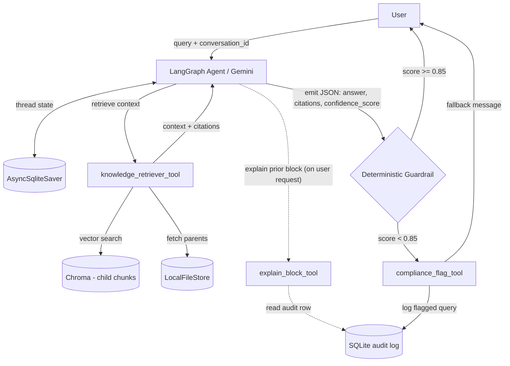

# Mexican Revolution GenAI Assistant

An internal RAG-powered conversational agent that answers questions about the Mexican Revolution (1910–1917) strictly from a curated source document. Built as a submission for Stori's Generative AI Challenge.

The system is an **Agentic RAG** with deterministic guardrails. The LLM orchestrates retrieval through tools and maintains multi-turn context via a persistent checkpointer. Each turn, the model emits a self-rated `confidence_score` in its JSON output; a deterministic Python layer reads that score against a 0.85 threshold and blocks any response below it. The decision logic is auditable in `agent/guardrail.py` and covered by unit tests; the confidence signal itself comes from the model. The threshold lives in code, not in the prompt.

## Quick start

```bash
cp .env.example .env   # add your GOOGLE_API_KEY
make up                # builds, ingests, and serves on http://localhost:8000
```

Open <http://localhost:8000> in your browser to chat with the agent. The agent is also available via `POST /chat` for programmatic access — see `USE_CASES.md` for examples.

**Windows users without make:** use `docker compose up --build -d` instead of `make up`. The Makefile is a convenience wrapper; equivalent docker compose commands work directly.

---

## 1. System Design Overview

### Architecture



The agent is a LangGraph state machine driven by a Gemini model bound to two tools: `knowledge_retriever_tool` (parent/child retrieval over Chroma) and `explain_block_tool` (reads the audit log to explain prior guardrail blocks when the user asks). A persistent `AsyncSqliteSaver` checkpointer hydrates conversation state per turn, so the model builds logically self-contained queries for the retriever — that is how follow-ups like *"and what did he do next?"* resolve without a separate rewriting node. Once the model has the retrieved context it emits a strict JSON payload `{answer, citations, confidence_score}`; a deterministic Python guardrail parses that JSON and blocks any response below the 0.85 threshold, persisting the blocked query and its retrieved context to a SQLite audit table via `compliance_flag_tool`. The user-facing UI is served from the same FastAPI process as embedded static HTML at `/`, alongside `/chat` and `/health`.

### Multi-turn follow-ups

> **Turn 1.** *"Who was Venustiano Carranza?"* — agent retrieves and answers.
>
> **Turn 2.** *"And what did he do after the presidency?"* — no proper noun in the message. The LLM reads the checkpointed history and constructs the query *"What did Venustiano Carranza do after his presidency?"* before invoking the retriever. The Chroma collection has no notion of conversation; the agent does.

### Scope enforcement

The challenge requires the agent refuse out-of-corpus questions. Enforcement happens in four layers:

1. **System prompt.** The model is instructed to answer only from retrieved context and to emit `confidence_score: 0.0` with empty `answer` when context is insufficient.
2. **Deterministic guardrail.** Any payload with `confidence_score < 0.85` is deterministically blocked regardless of how confident the prose sounds. Nine enumerable block reasons (parse failures, missing keys, low confidence, etc.) — all covered by the unit test suite at `tests/test_guardrail.py`.
3. **Audit log.** Blocked queries are persisted with their retrieved context, so the failure mode is observable instead of silent.
4. **Conversational onboarding.** Greetings, capability questions, and acknowledgments are handled explicitly with brief responses plus a scope nudge (*"I'm specialized in the Mexican Revolution, 1910–1917…"*), so first contact does not produce a guardrail block.

### The extended tool: `explain_block_tool`

The challenge brief suggests examples like conversation summary, classification, or human escalation. Summary and classification are native LLM capabilities under prompting — wrapping them as tools adds ceremony, not capability. Human escalation has no plausible business meaning for questions about a single historical corpus.

`explain_block_tool` reads the audit log (a SQLite row written by the guardrail when a response is blocked) and returns the structured reason — category, confidence score, threshold, retrieved pages, timestamp — for the model to articulate in natural language.

**Why not let the model reconstruct this from conversation history.** A fair question. Two pieces of information needed to explain a block live outside the model's reach by design:

1. **The threshold itself.** The model emits `confidence_score: 0.5`. Whether 0.5 is acceptable is a business decision (currently 0.85) that lives in Python, not in the model. The model cannot tell the user *"and that fell below threshold"* without being given the threshold.
2. **The structured audit row.** The fallback message returned to the user is generic (*"I don't have a solid answer for that"*). The structured `reason`, retrieved snippets, blocked timestamp, and category live in the `flagged_queries` table — not in the conversation. The state carries a generic refusal; the audit table carries the why.

Without the tool, the model could at best say *"I blocked the previous answer"* from history. It could not say *"because confidence was 0.5 against a 0.85 threshold, and the snippets I retrieved did not cover the question"*. That second answer is what an internal user actually needs.

The pattern generalizes: any system where automated decisions are explained back to a human reviewer needs a structured audit trail outside the model's context window, and a way to query it. The historical corpus here is a stand-in for the underlying shape — decision logged, threshold and reason structured, queryable by an explainer tool.

See [`USE_CASES.md`](USE_CASES.md) for the tool in action.

### Design tradeoffs

Full decision records (context + decision + alternative rejected) live in [`docs/architecture-decisions.md`](docs/architecture-decisions.md). The summary:

| Decision | Rejected alternative |
|---|---|
| Closed ingestion (CLI/job) | Public `/upload` endpoint |
| Single-pass deterministic guardrail | LLM-as-judge in the request path |
| Parent Document Retrieval | Flat chunking at a single size |
| Confidence threshold 0.85, set conservatively | Heuristic, uncalibrated |
| `explain_block_tool` as the extended tool | Summary / classification / human escalation |
| Docker: separate `ingest` job + gosu step-down | Single-process container with `USER app` |

The choice of a **single-pass guardrail** (no second LLM as judge at runtime) is a deliberate stance, not a deferral. For an informational assistant over a curated corpus, doubling latency and cost on every turn to validate a result that is already deterministically checked is not justified. The number of safety layers should scale with the cost of being wrong, not with the desire for defense-in-depth on principle. A second LLM judge would be appropriate for higher-risk domains (credit decisioning, KYC, fraud), where a false positive carries real financial or regulatory cost; here it does not.

### What I would improve with more time

1. **Hexagonal architecture** for the LLM and embedding providers — swap Gemini ↔ Anthropic ↔ OpenAI without touching agent code.
2. **Pre-input guardrail** (length cap, prompt-injection signatures, content-policy sniff) before the model runs. Out of scope here because the post-output guardrail covers the failure modes that matter for a single-corpus internal assistant; required for a public-facing or higher-stakes deployment.
3. **Dynamic RBAC.** Per-document `access_level` is already stamped at ingestion; the enforcement layer at retrieval time is the missing piece.
4. **Answer Relevance** as an offline eval metric. The current suite checks faithfulness (answer↔context) but not relevance (answer↔question). A perfectly faithful but off-topic answer would score 1.0 today.
5. **AWS Bedrock Guardrails** once the system migrates to Bedrock — offload input/output validation to managed infrastructure.
6. **Parallelize the eval suite** with `asyncio.gather` + a small semaphore. Currently sequential (~60s for 10 cases). Deferred to avoid hitting Gemini's free-tier rate limit on shared eval runs.

---

## 2. Evaluation

The eval pipeline lives in [`evals/`](evals/) and is runnable end-to-end:

```bash
make eval          # replays evals/dataset.yaml against the compiled graph
```

It scores **behavior match** (block vs answer), **tool selection** (was the retriever called when expected), **citation validity** (reported pages ⊆ retrieved pages), and **faithfulness** (offline LLM-as-judge: decomposes the answer into atomic claims and checks each against retrieved context). The model's `confidence_score` is recorded per query.

The judge catches a class of error citation validity misses: the model citing the correct page and then misstating what is on it — for example, conflating the proclamation date of the Plan de San Luis with the date the plan called the country to arms. Page is cited correctly; the claim is wrong. The judge runs offline, once per dataset run, consistent with the runtime single-pass decision above — the cost critique against LLM-as-judge applies to per-turn validation, not per-eval scoring. The judge uses the same model family (Gemini 2.5 Flash) as the agent, so it shares the generator's blind spots; a heterogeneous judge (e.g., Claude on Bedrock) would give more independent validation and is listed under Improvements.

The iteration log lives in [`TUNING.md`](TUNING.md): defensive behavior under a partially-rebuilt Chroma store, the dataset realignment after observing the model's correct conservative behavior on partial-coverage and no-antecedent cases (now 10/10 behavior matches — `multiturn_01` turn 2 demonstrates the follow-up requirement via Spanish pro-drop coreference on a corpus-covered question, `multiturn_02` is an honest block-by-design where the corpus names who proclaimed the Plan de Ayala but not who drafted it), and a latent `null`-answer bypass the unit test suite caught after-the-fact.

The test suite at [`tests/`](tests/) covers the deterministic guardrail (31 tests over all nine block reasons) plus language detection (11 tests). 42 tests total, pure logic, no LLM calls; runs in under 50 ms via `make test`.

---

## 3. Local deployment

### Prerequisites

- Docker and Docker Compose
- A `GOOGLE_API_KEY` from Google AI Studio

### Run

```bash
cp .env.example .env
# edit .env, set GOOGLE_API_KEY
make up
```

### Operational commands

The Makefile groups the full container lifecycle:

| Command | Purpose |
|---|---|
| `make up` | Build, run ingest, start server on :8000 |
| `make down` | Stop containers (preserves the index in volumes) |
| `make restart` | Restart the server only (no re-ingestion) |
| `make clean` | Full reset (deletes containers and volumes; forces re-ingestion) |
| `make logs` | Follow server logs |
| `make eval` | Run the offline evaluation suite |
| `make test` | Run unit tests locally |
| `make test-docker` | Run unit tests inside the container |
| `make shell` | Open a shell in the running container |

Run `make` with no arguments to see the full list.

<details>
<summary><strong>Windows users without make</strong> — equivalent docker compose commands</summary>

| Make target | Docker compose equivalent |
|---|---|
| `make up` | `docker compose up -d --build` |
| `make down` | `docker compose down` |
| `make restart` | `docker compose restart rag` |
| `make clean` | `docker compose down -v` |
| `make logs` | `docker compose logs -f rag` |
| `make eval` | `docker compose run --rm rag python -m evals.run` |
| `make test` | `pytest tests/ -v` |
| `make test-docker` | `docker compose run --rm --entrypoint pytest rag tests/ -v` |
| `make shell` | `docker compose exec rag /bin/bash` |

The Makefile is a convenience wrapper. Any of these commands run directly without `make` installed.

</details>

####
The compose file separates ingestion from serving: an `ingest` job runs once (idempotent — re-runs detect an existing index and skip), then the `rag` service starts and serves on port 8000. The container starts as root only to fix ownership of named volumes, then drops to a non-root user via `gosu` before launching uvicorn — the same pattern used by official postgres / mysql / redis images.

UI at <http://localhost:8000>. Health at <http://localhost:8000/health>. Chat endpoint at `POST /chat`.

### Without Docker

If you can't use Docker, you can run the system in a local Python environment.

**1. Set up Python environment:**

```bash
python -m venv venv
# Unix/Mac:
source venv/bin/activate
# Windows:
venv\Scripts\activate

pip install -r requirements.txt
```

**2. Configure API key:**

```bash
cp .env.example .env
# Edit .env to add your GOOGLE_API_KEY
```

**3. Ingest the corpus (idempotent — safe to re-run):**

```bash
python ingestion.py
```

**4. Start the server:**

```bash
uvicorn app:app
```

Then open <http://localhost:8000>. **Do not use `--reload`**: a module-level Chroma open would double on reload and contend on the SQLite file. For development hot-reload, use `make up` (the Docker setup is isolated from this constraint).

---

## 4. Project structure

```
.
├── app.py                          # FastAPI: /, /health, /chat
├── ingestion.py                    # PDF loader, hierarchical chunking, idempotent
├── entrypoint.sh                   # Docker entrypoint (root-fix + gosu step-down)
├── Dockerfile
├── docker-compose.yml
├── Makefile
├── requirements.txt
├── README.md
├── TUNING.md                       # iteration log
├── USE_CASES.md                    # guided walkthrough for reviewers
├── agent/
│   ├── graph.py                    # LangGraph state machine
│   ├── tools.py                    # knowledge_retriever_tool, explain_block_tool, compliance_flag_tool
│   ├── guardrail.py                # deterministic JSON + threshold validator
│   ├── prompts.py                  # system prompt + fallback messages
│   └── db.py                       # SQLite for flagged_queries audit log
├── docs/
│   └── architecture-decisions.md   # ADRs (Nygard format)
├── evals/
│   ├── dataset.yaml                # 10 cases across 5 categories
│   ├── run.py                      # replays dataset, scores per case
│   └── judge.py                    # offline faithfulness judge
├── tests/
│   └── test_guardrail.py           # 31 unit tests over the guardrail
├── static/
│   └── index.html                  # embedded chat UI (vanilla JS, no build)
├── raw_docs/                       # source PDF(s)
└── infra/                          # AWS CDK stack (bonus; synth-only)
    ├── app.py
    └── stacks/                     # network, data, compute, ingest
```

Generated artifacts (`chroma_db/`, `parent_doc_store/`, `agent_db/`) are gitignored and produced at runtime.

---

## 5. Production architecture (AWS CDK — bonus)

A CDK stack under [`infra/`](infra/) describes the cloud deployment:

| Local | Production |
|---|---|
| `docker compose` (ingest + rag services) | ECS Fargate cluster, two task definitions sharing one image |
| Chroma + parent store on Docker volumes | S3 index bucket (loaded at task start) |
| `raw_docs/` | S3 corpus bucket |
| `agent_db/` (SQLite checkpointer + audit) | DynamoDB table (TTL on stale threads) |
| `make ingest` | `aws ecs run-task` against the ingest task definition |
| `GOOGLE_API_KEY` from `.env` | Secrets Manager (deliberately out of scope for this synth) |

The stack is synth-correct (produces valid CloudFormation across four stacks: network, data, compute, ingest) but not deployed. Out-of-scope items — HTTPS, WAF, custom VPC topology, CI/CD, multi-region, observability dashboards, Bedrock migration — are enumerated in [`infra/README.md`](infra/README.md). The point of including the stack is to communicate the production *shape*, not to consume budget on infrastructure that is not part of the evaluation.

---

## 6. What this submission is — and isn't

This is a prototype, not a production system. The decisions reflect an explicit choice to invest time in reasoning and product thinking over feature breadth. Each non-trivial decision lists the alternative that was rejected and the reason in [`docs/architecture-decisions.md`](docs/architecture-decisions.md), so a reviewer can see what was considered and why something was not built.

The pieces that matter for evaluation — reasoning, scoping, product thinking, system design — are concentrated in section 1 (overview, tradeoffs, improvements), section 2 (evaluation methodology), the ADR file, and [`USE_CASES.md`](USE_CASES.md). The runtime code is the smallest viable demonstration that those decisions hang together.
