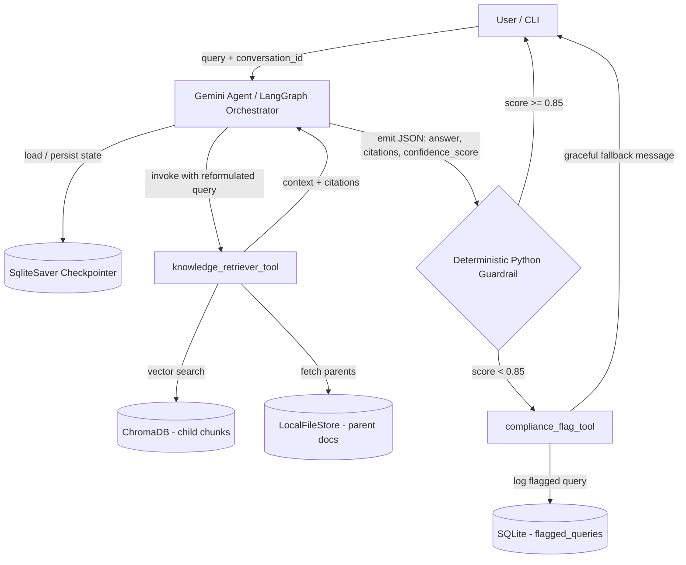

# Mexican Revolution GenAI Assistant

An internal RAG-powered conversational agent that answers questions about the Mexican Revolution (1910–1917) strictly from a curated source document. Built as a submission for Stori's Generative AI Challenge.

The system is designed as an **Agentic RAG** with deterministic guardrails: the LLM orchestrates retrieval via tools, maintains multi-turn context through a persistent checkpointer, and self-evaluates its own confidence on a numeric score that a Python layer intercepts before any response reaches the user.

### How to Read This Document

The challenge brief states that the reviewers care about *reasoning and autonomy*, *scoping*, and *product thinking and system design* — more than perfect runtime performance. This README is organized to surface that work, not to bury it:

- Section 1 covers the runtime architecture and the two behaviours the spec calls out explicitly: multi-turn follow-ups and scope enforcement.
- Section 2 documents every meaningful decision as a tradeoff, naming the alternative that was rejected and why. This is where the reasoning lives.
- Section 3 covers evaluation as a *loop*, not a static metric list — how the system was refined and how the next refinement would happen.
- Sections 6 and 7 (production architecture and improvements with more time) describe the scope that was deliberately deferred and the reasoning behind deferring it.

---

## 1. System Design Overview

### Architectural Diagram



### How the Components Interact

The agent is a LangGraph state machine driven by a single Gemini model that acts both as orchestrator and as the generation layer. On every turn the agent receives the user query plus a `conversation_id`; LangGraph's `SqliteSaver` checkpointer hydrates the full conversation state (history, prior tool calls, prior context) so the LLM can produce a **logically self-contained query** when it invokes `knowledge_retriever_tool` — this is how follow-ups like *"and what did he do next?"* are resolved without a separate rewriting node.

Retrieval uses a **hierarchical parent document strategy**: small child chunks (400 chars) are embedded into ChromaDB for high-precision vector matching, while their enclosing parent chunks (2000 chars) are returned to the LLM as full context. Once the LLM has the context, it is prompted to emit a strict JSON payload `{answer, citations, confidence_score}`. A deterministic Python layer parses that JSON; if `confidence_score < 0.85`, the user-facing answer is blocked and `compliance_flag_tool` persists the failed query to a SQLite audit table for asynchronous review.

### Follow-up Behaviour in Practice

The persistence layer is only as useful as the queries the LLM builds from it. A concrete trace:

> **Turn 1.** User: *"Who was Venustiano Carranza?"*
> Agent retrieves and answers from the corpus.
>
> **Turn 2.** User: *"And what did he do after the presidency?"*
> The user message contains no proper noun. Before invoking `knowledge_retriever_tool`, the LLM reads the checkpointed history and constructs the search query *"What did Venustiano Carranza do after his presidency?"* — a logically self-contained string the retriever can embed against. The Chroma collection has no notion of conversation; the agent does.

### Scope Enforcement: "No Answer Outside the Corpus"

The challenge requires that the agent not answer questions outside the scope of the documents or its existing knowledge. This is enforced at three layers, not left to the LLM's discretion:

1. **System prompt.** The model is instructed to answer *only* from the retrieved context, to never use its parametric knowledge of the Mexican Revolution, and to emit `confidence_score = 0.0` with an empty `answer` when the retrieved chunks do not contain the information needed.
2. **Deterministic guardrail.** Any payload with `confidence_score < 0.85` is structurally blocked from reaching the user, regardless of how confident the prose sounds. The score is the gate, not the wording.
3. **Compliance log.** Every blocked query is persisted to `flagged_queries` with the retrieved chunks attached, so the failure mode is *observable* — out-of-scope attempts produce data, not silent refusals.

This matters because Gemini has plenty of general knowledge about Pancho Villa; without the three layers above, the model would happily answer from training data and the system would silently violate the spec.

---

## 2. Design Tradeoffs & Assumptions

Every decision below was made under the constraint of a time-boxed challenge that values **reasoning and product thinking over feature completeness**. Each tradeoff lists the alternative we rejected and the reason.

The table below is the scannable version; the subsections that follow it carry the reasoning.

| # | Decision | Rejected Alternative |
|---|---|---|
| 2.1 | Closed ingestion via backend script | Public `/upload` endpoint |
| 2.2 | Single-pass self-evaluating guardrail | Second "judge" LLM (Double Validator) |
| 2.3 | LLM reformulates query at tool invocation | Dedicated rewriting node in the graph |
| 2.4 | LangGraph `SqliteSaver` checkpointer | Hand-rolled `messages` table |
| 2.5 | Hierarchical parent/child chunking | Flat chunking at a single size |
| 2.6 | Single-layer deterministic compliance | Defense-in-depth (semantic + deterministic) |
| 2.7 | Gemini for generation and embeddings | Multi-provider stack (Gemini + Anthropic) |
| 2.8 | `compliance_flag_tool` (audit logging) | Conversation summary / classification / human escalation |
| 2.9 | Confidence threshold of `0.85` (heuristic) | Empirically calibrated value |

### 2.1 Closed Ingestion vs. Public Upload Endpoint
- **Decision:** Ingestion runs as a backend script (`ingestion.py`) executed at container startup against `raw_docs/`.
- **Rejected alternative:** Exposing a `/upload` endpoint so users could feed the agent arbitrary documents at chat time.
- **Why:** The product is an *internal* assistant over a curated corpus. A public upload path adds prompt-injection-via-PDF risk and runtime latency without serving the stated use case.

### 2.2 Single-Pass Self-Evaluating Guardrail vs. LLM-as-Judge
- **Decision:** Force the primary LLM to emit a JSON payload including a `confidence_score`; a deterministic Python check blocks responses where the score is below `0.85`.
- **Rejected alternative:** A second "judge" LLM that validates the first one's output (the "Double Validator" / NeMo-style pattern).
- **Why:** A second LLM doubles API cost and time-to-first-token on every turn. The self-evaluating approach delivers near-equivalent safety for a fraction of the cost. The cost of being wrong here is bounded — failed queries are logged and reviewable.

### 2.3 LLM Tool-Driven Query Reformulation vs. Explicit Rewriting Node
- **Decision:** The LLM constructs the search query *at the moment it invokes* `knowledge_retriever_tool`, using its conversation history. There is no separate rewriting step.
- **Rejected alternative:** A dedicated LangGraph node that rewrites the query before invoking the retriever.
- **Why:** The LLM already holds the conversation history in context; adding a separate node duplicates responsibility and adds latency without measurable quality gain at this scale.

### 2.4 LangGraph `SqliteSaver` vs. Hand-Rolled SQLite Schema
- **Decision:** Use LangGraph's official `SqliteSaver` checkpointer for multi-turn persistence.
- **Rejected alternative:** A manual `messages(conversation_id, role, content, ts)` table.
- **Why:** The checkpointer persists the *entire graph state* per turn — reformulated queries, retrieved context, JSON payloads, tool calls — not just messages. This is essential for the eval pipeline (turn replay) and the audit story. Re-implementing it would be reinventing the wheel.

### 2.5 Hierarchical Parent Document Retrieval vs. Flat Chunking
- **Decision:** Child chunks (400 chars / 50 overlap) embedded into Chroma; parent chunks (2000 chars / 200 overlap) stored in `LocalFileStore` and returned as full context on match. PDFs are loaded **page by page** so page numbers survive into chunk metadata.
- **Rejected alternative:** A single chunk size optimized for either precision or context.
- **Why:** Historical narrative density (dates, names, sequential events) was breaking on flat character chunking — critical facts ended up split across chunks. The hierarchical approach gives the embedding model short windows for precise vector matching while feeding the LLM enough surrounding context to answer faithfully. Page-by-page loading preserves citations.

### 2.6 Single-Layer Deterministic Compliance vs. Defense-in-Depth
- **Decision:** Only the deterministic Python guardrail invokes `compliance_flag_tool` (when `confidence_score < 0.85`).
- **Rejected alternative (for v1):** A second "semantic" layer in which the LLM itself proactively invokes the compliance tool on out-of-scope or malicious queries (early exit).
- **Why:** The semantic layer requires additional prompt engineering and adds new failure modes (the LLM must decide *when* to escalate). The deterministic layer already covers low-confidence and unanswerable queries, which is where the bulk of hallucination risk lives. The semantic layer is listed under section 7 (Improvements With More Time).

### 2.7 Single LLM Provider (Gemini) vs. Multi-Provider Stack
- **Decision:** Gemini for both generation and embeddings (`GoogleGenerativeAIEmbeddings`).
- **Rejected alternative:** Gemini embeddings + Anthropic (Claude) for generation.
- **Why:** One API key, one rate-limit profile, one provider-specific bug surface. A multi-provider setup is justified once embedding quality and generation quality genuinely diverge; for a prototype on a single corpus, it is operational overhead with no observable gain.

### 2.8 Tool Choice: `compliance_flag_tool` vs. Conversation Summary / Classification
- **Decision:** A single tool that persists out-of-scope and low-confidence queries to a `flagged_queries` SQLite table for asynchronous audit.
- **Rejected alternatives:** Conversation summary; conversation classification; human-escalation trigger.
- **Why:** Summary and classification are cosmetic for this product. Human-escalation has no plausible business meaning for questions about the Mexican Revolution. **Compliance logging** does — it mirrors how a fintech like Stori actually treats out-of-policy interactions, and it creates a feedback loop: flagged queries become the dataset for tuning prompts, expanding the corpus, or calibrating the confidence threshold.

### 2.9 Confidence Threshold of 0.85
- **Decision:** Hard threshold at `0.85`.
- **Assumption:** This is a **heuristic initial value**, not an empirically calibrated one. The eval pipeline (section 3) is the mechanism by which a future, data-driven threshold would be set — by sweeping the value against a labeled set of in-scope / out-of-scope queries and selecting the inflection point that minimizes false rejections while keeping hallucinations below tolerance.

---

## 3. Evaluation Strategy

Tuning a RAG by "vibes" is the failure mode this section is meant to prevent. The evaluation pipeline measures three metrics over a held-out set of curated queries:

1. **Faithfulness (Contextual Fidelity).** Every factual claim in the generated answer must be reconstructible from the retrieved parent chunks. Numerical facts (dates, casualty figures, names) that cannot be grounded in the retrieved context are an automatic failure.
2. **Answer Relevance.** Does the answer address the user's actual intent, or does it dump context and evade the question? Penalizes both empty refusals on in-scope queries and verbose non-answers.
3. **Tool Selection.** Did the agent invoke `knowledge_retriever_tool` when it should have? Did the deterministic guardrail correctly route low-confidence outputs to `compliance_flag_tool`? Measured as precision/recall over an annotated set.

The `confidence_score` emitted by the LLM is itself a metric — its distribution across the eval set tells us whether `0.85` is the right threshold.

### The Tuning Loop

Tuning is treated as a loop, not a one-off pass: measure on the eval set, identify the lowest-scoring metric, hypothesize a single change, re-measure. What follows is the trace of that loop as it stands today, plus the next iterations queued behind it.

**Iteration 1 — Chunking strategy.**
Flat character chunking at 500 chars split revolutionary dates and names across chunk boundaries. A question about *"Plan de Guadalupe, 1913"* would retrieve a chunk that mentioned the plan but not the year — Faithfulness scored well (the answer didn't hallucinate) but Answer Relevance collapsed (the model had to refuse). The fix was the hierarchical parent/child strategy in section 2.5: children small enough for sharp embedding matches, parents large enough to preserve the surrounding narrative. Answer Relevance recovered on the same query set.

**Iteration 2 — Page-aware loading.**
The retriever returned correct text but citations were unusable: chunk metadata had no stable reference to where in the document the answer came from. Loading the PDF page by page before chunking, and stamping `page` onto each `Document`, made citations like *"p. 7"* possible. This is what turns the assistant from a confident narrator into an auditable one.

**Iteration 3 — Threshold of the deterministic guardrail.**
The current threshold of `0.85` is a heuristic starting point, not a calibrated one. The next loop runs the agent over a labelled set of in-scope and out-of-scope queries, sweeps the threshold across `[0.5, 0.95]`, and picks the value that maximizes the gap between true rejections of out-of-scope queries and false rejections of valid ones. The `flagged_queries` table is the dataset for that sweep — every block is a labelled negative.

**Iteration 4 — Tool selection diagnostics.**
Tool Selection is measured but not yet acted on. The next loop will inspect cases where the agent invoked `knowledge_retriever_tool` with a poorly reformulated follow-up query (the most common failure mode for multi-turn) and adjust the system prompt's instructions on how to construct the search string from history.

The point of writing this section is not to claim the work is finished — it is to make the *method* legible. A reviewer should be able to read this and predict what the next change would be without asking.

---

## 4. Local Deployment

### Prerequisites
- Docker and Docker Compose installed locally.
- A valid `GOOGLE_API_KEY` (Gemini).

### Run
1. Create a `.env` file at the repository root:
   ```
   GOOGLE_API_KEY=your_api_key_here
   ```
2. Build and start the container:
   ```bash
   docker compose up --build
   ```
3. The container will run `ingestion.py` once at startup (idempotent — re-runs detect an existing collection and skip re-ingestion), then expose the chat interface.

### Without Docker (development)
```bash
make install
python ingestion.py
# then launch the agent entrypoint
```

---

## 5. Project Structure

```
.
├── ingestion.py               # PDF loader, hierarchical chunking, RBAC metadata, Chroma + parent store
├── raw_docs/                  # Source PDF(s); the only documents the agent will ever answer about
├── croma_db/                  # ChromaDB persistence (generated; gitignored)
├── parent_doc_store/          # LocalFileStore for parent chunks (generated; gitignored)
├── cdk/                       # AWS CDK stack for the production architecture (see section 6)
├── Dockerfile
├── docker-compose.yml
└── README.md
```

---

## 6. Production Architecture (AWS CDK — Bonus)

The local Dockerfile is the deliverable for section 3 of the challenge submission. A complementary AWS CDK stack under `cdk/` describes how this system would be deployed for real, mapping each local component to its managed AWS counterpart:

| Local Component | Production Mapping |
|---|---|
| FastAPI/CLI process in Docker | **ECS Fargate** service behind an Application Load Balancer in a private VPC |
| ChromaDB (`croma_db/`) | **Amazon OpenSearch Serverless** (or a managed Pinecone) — explicit separation of compute and vector storage |
| `parent_doc_store/` (LocalFileStore) | **Amazon S3** with versioning |
| `ingestion.py` at container startup | **S3 → Lambda** event-driven ingestion: PDF uploads to an S3 bucket trigger a Lambda worker that chunks, embeds, and writes to OpenSearch — zero impact on the live conversational service |
| `SqliteSaver` checkpointer | **Amazon DynamoDB** (or RDS for Postgres) for multi-turn state |
| `flagged_queries.sqlite` | **DynamoDB** audit table, with EventBridge fan-out to a review queue |
| LLM calls (Gemini API) | **AWS Bedrock** (Claude on Bedrock for native multi-region availability and per-tenant Guardrails) |

The CDK stack is provided as a deployable artifact but not deployed as part of this submission — it exists to demonstrate the production design, not to consume budget on infrastructure that isn't part of the evaluation.

---

## 7. Improvements With More Time

What I would build next, in priority order:

1. **Semantic compliance layer (defense in depth).** Add a second path where the LLM itself can invoke `compliance_flag_tool` early on obviously out-of-scope or malicious queries, saving the cost of a full retrieval round-trip. Skipped in v1 because the deterministic layer alone already covers the majority of hallucination risk.
2. **Hexagonal architecture (Ports & Adapters).** Abstract the embeddings and LLM providers behind ports so the system can swap Gemini ↔ Anthropic ↔ OpenAI without touching agent logic. Skipped in v1 because writing abstract interfaces for a time-boxed prototype is overengineering.
3. **Dynamic RBAC.** Per-document `access_level` derived from a manifest, with per-user authorization at retrieval time. The metadata stamping is already in place (`access_level: "internal_confidential"`); only the enforcement layer is missing.
4. **Empirical calibration of the confidence threshold.** Build a labeled eval set of in-scope / out-of-scope queries and sweep the threshold to find the inflection point. Replaces the current heuristic `0.85` with a defensible number.
5. **AWS Bedrock Guardrails.** Offload programmatic input/output validation to managed infrastructure once the system is on Bedrock.
6. **Self-healing compliance loop.** Vectorize flagged queries into a segregated admin-only collection so administrators can use the RAG itself to audit its own vulnerabilities, gated by RBAC.

---

## 8. What This Submission Is — and Isn't

This is a **prototype**, not a production system. The decisions documented in section 2 reflect the explicit choice to invest time in *reasoning depth and product thinking* rather than feature breadth. Every rejected alternative is listed by name so the reviewer can see what was considered and why it was not built.

The pieces that genuinely matter for the evaluation criteria — **reasoning, scoping, product thinking, system design** — are concentrated in section 2 (tradeoffs), section 3 (evaluation), section 6 (production design), and section 7 (roadmap). The runtime code is the smallest viable demonstration that those decisions hang together.
